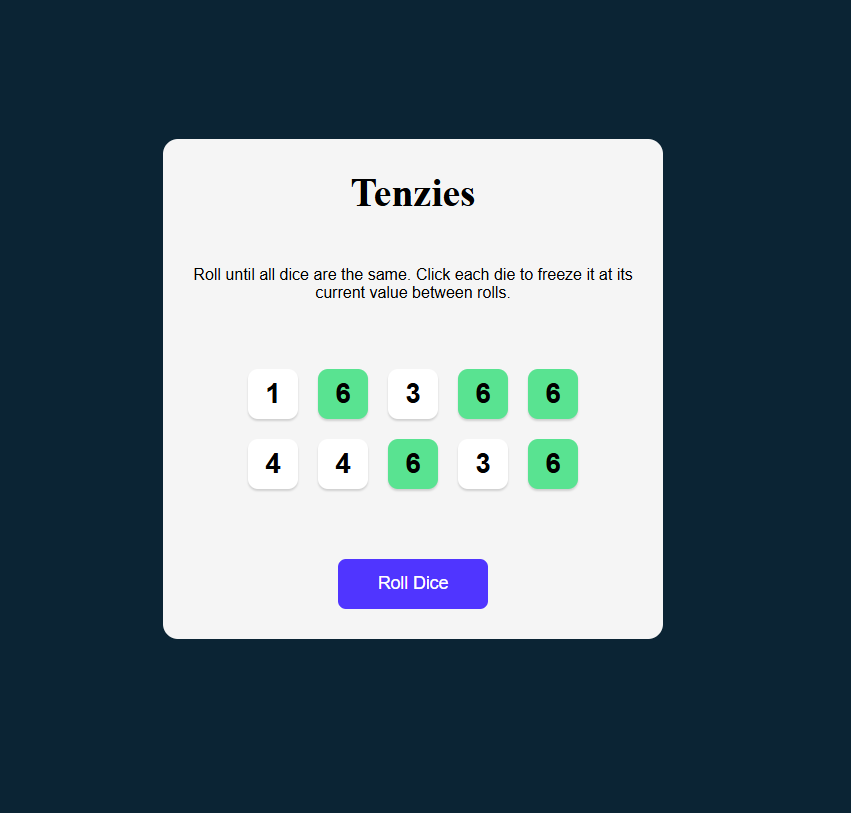
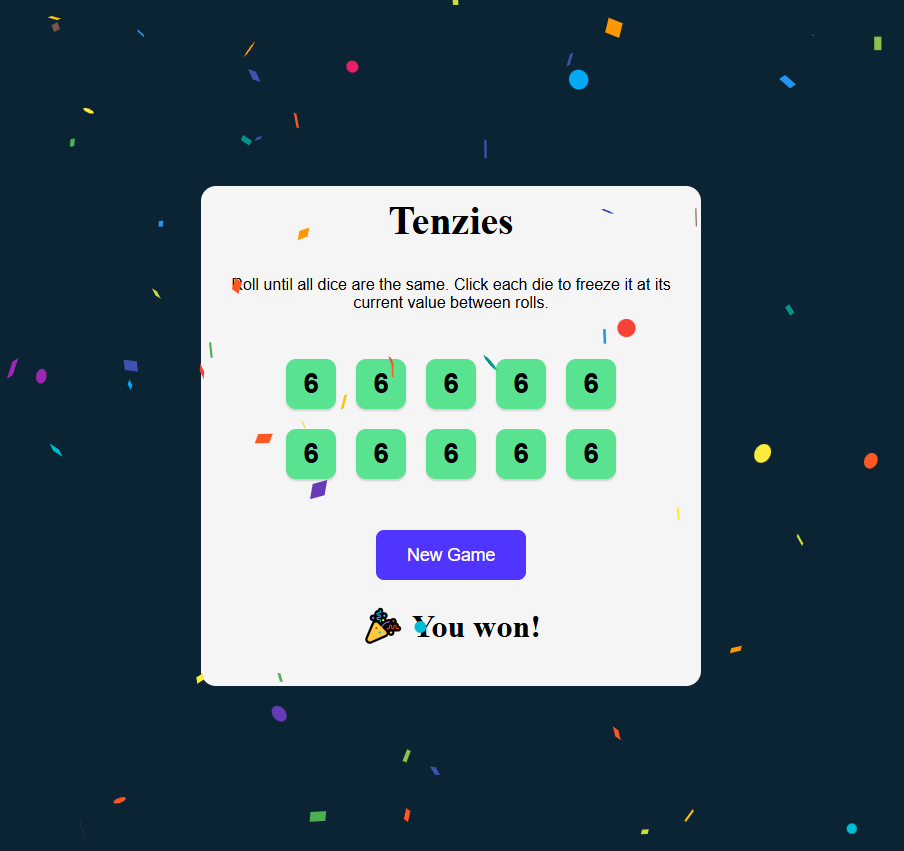

# 🎲 Tenzies Game

Tenzies is a fun and interactive dice-rolling game built with React. The goal is to roll the dice until all of them have the same value. The game features state management, unique IDs with `nanoid`, and smooth gameplay.

## 🚀 Features

- 🎲 Roll the dice until all numbers match
- 🔄 Keep selected dice while rolling others
- 🎉 Confetti effect on win (`react-confetti`)  
- 🆔 Unique dice IDs with `nanoid`
- 🎨 Clean and fun UI
- 🏆 Game win screen

## 📸 Screenshots

### Home Screen


---

### Game Won Screen


## 🛠️ Installation & Setup

1. Clone the repository:
   ```bash
   git clone https://github.com/yourusername/tenzies-game.git
